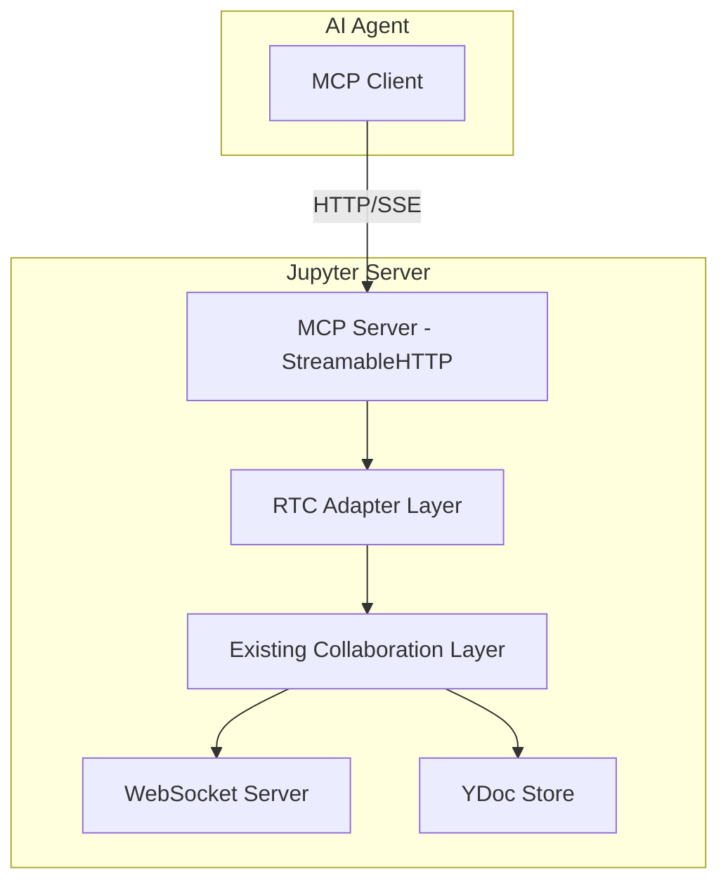

# MCP Server for Jupyter Collaboration - Design Document

## Overview

This document outlines the design for adding MCP (Model Context Protocol) server endpoints to expose Jupyter Collaboration's real-time collaboration (RTC) functionalities to AI agents. The solution will be implemented as a separate JupyterLab extension called `jupyter-collaboration-mcp`.

## Problem Statement

AI agents need a way to interact with collaborative Jupyter notebooks and documents in real-time. The existing Jupyter Collaboration system provides robust RTC capabilities using YDoc (CRDT) technology, but lacks an API specifically designed for AI agent integration. This project aims to bridge that gap by exposing RTC functionalities through MCP endpoints.

## Architecture

### High-Level Architecture



### Key Components

1. **MCP Server (StreamableHTTP)**: Based on the MCP StreamableHTTP example, using HTTP with Server-Sent Events (SSE) for real-time communication with AI agents.

2. **RTC Adapter Layer**: A new component that translates MCP requests into operations on the existing collaboration system.

3. **Event Store**: For resumability and state management, similar to the example's `InMemoryEventStore`.

4. **Authentication & Authorization**: Integrated with Jupyter's existing security infrastructure.

## Implementation Approach

### Separate Extension vs. Feature PR

After analyzing the project structure and requirements, we recommend implementing this as a **separate JupyterLab extension** rather than a feature PR into the existing project.

### Advantages of a Separate Extension

1. **Modularity**: Keeps MCP-specific code isolated from the core collaboration functionality
2. **Maintainability**: Easier to update and maintain without affecting the stable collaboration features
3. **Optional Installation**: Users can choose whether to install MCP functionality
4. **Independent Development**: Can follow its own release cycle independent of the main collaboration project
5. **Clear Separation of Concerns**: The main project focuses on RTC, while the new extension focuses on AI agent integration

### Proposed Extension Structure

```
jupyter-collaboration-mcp/
├── pyproject.toml
├── setup.py
├── jupyter_collaboration_mcp/
│   ├── __init__.py
│   ├── __main__.py
│   ├── app.py              # Main MCP server application
│   ├── handlers.py         # MCP request handlers
│   ├── rtc_adapter.py      # Adapter to existing RTC functionality
│   ├── event_store.py     # For resumability
│   ├── auth.py            # Authentication and authorization
│   └── utils.py           # Utility functions
└── tests/
    ├── __init__.py
    ├── test_app.py
    ├── test_handlers.py
    └── test_auth.py
```

## MCP Endpoints

### Notebook Collaboration Features

#### 1. Notebook Access and Management

##### Tool: `list_notebooks`
- **Description**: Lists all available notebooks that can be collaborated on
- **Input Schema**:
  ```json
  {
    "type": "object",
    "properties": {
      "path": {
        "type": "string",
        "description": "Optional path to filter notebooks"
      }
    }
  }
  ```
- **Returns**: List of notebook paths with collaboration status

##### Tool: `get_notebook`
- **Description**: Retrieves the content of a specific notebook
- **Input Schema**:
  ```json
  {
    "type": "object",
    "required": ["path"],
    "properties": {
      "path": {
        "type": "string",
        "description": "Path to the notebook"
      },
      "include_collaboration_state": {
        "type": "boolean",
        "description": "Whether to include collaboration metadata",
        "default": true
      }
    }
  }
  ```
- **Returns**: Notebook content with collaboration metadata

##### Tool: `create_notebook_session`
- **Description**: Creates or retrieves a collaboration session for a notebook
- **Input Schema**:
  ```json
  {
    "type": "object",
    "required": ["path"],
    "properties": {
      "path": {
        "type": "string",
        "description": "Path to the notebook"
      }
    }
  }
  ```
- **Returns**: Session information including room ID and session ID

#### 2. Notebook Content Manipulation

##### Tool: `update_notebook_cell`
- **Description**: Updates the content of a specific cell in a notebook
- **Input Schema**:
  ```json
  {
    "type": "object",
    "required": ["path", "cell_id", "content"],
    "properties": {
      "path": {
        "type": "string",
        "description": "Path to the notebook"
      },
      "cell_id": {
        "type": "string",
        "description": "ID of the cell to update"
      },
      "content": {
        "type": "string",
        "description": "New content for the cell"
      },
      "cell_type": {
        "type": "string",
        "enum": ["code", "markdown"],
        "description": "Type of the cell"
      }
    }
  }
  ```
- **Returns**: Confirmation of the update

##### Tool: `insert_notebook_cell`
- **Description**: Inserts a new cell into a notebook
- **Input Schema**:
  ```json
  {
    "type": "object",
    "required": ["path", "content", "position"],
    "properties": {
      "path": {
        "type": "string",
        "description": "Path to the notebook"
      },
      "content": {
        "type": "string",
        "description": "Content for the new cell"
      },
      "position": {
        "type": "integer",
        "description": "Position to insert the cell (0-based index)"
      },
      "cell_type": {
        "type": "string",
        "enum": ["code", "markdown"],
        "default": "code",
        "description": "Type of the cell"
      }
    }
  }
  ```
- **Returns**: ID of the newly created cell

##### Tool: `delete_notebook_cell`
- **Description**: Deletes a cell from a notebook
- **Input Schema**:
  ```json
  {
    "type": "object",
    "required": ["path", "cell_id"],
    "properties": {
      "path": {
        "type": "string",
        "description": "Path to the notebook"
      },
      "cell_id": {
        "type": "string",
        "description": "ID of the cell to delete"
      }
    }
  }
  ```
- **Returns**: Confirmation of the deletion

#### 3. Notebook Execution

##### Tool: `execute_notebook_cell`
- **Description**: Executes a specific cell in a notebook
- **Input Schema**:
  ```json
  {
    "type": "object",
    "required": ["path", "cell_id"],
    "properties": {
      "path": {
        "type": "string",
        "description": "Path to the notebook"
      },
      "cell_id": {
        "type": "string",
        "description": "ID of the cell to execute"
      },
      "timeout": {
        "type": "integer",
        "description": "Execution timeout in seconds",
        "default": 30
      }
    }
  }
  ```
- **Returns**: Execution result including output and execution count


### Document Collaboration Features

#### 1. Document Access and Management

##### Tool: `list_documents`
- **Description**: Lists all available documents that can be collaborated on
- **Input Schema**:
  ```json
  {
    "type": "object",
    "properties": {
      "path": {
        "type": "string",
        "description": "Optional path to filter documents"
      },
      "file_type": {
        "type": "string",
        "description": "Optional file type to filter (e.g., 'file', 'text', 'markdown')"
      }
    }
  }
  ```
- **Returns**: List of document paths with collaboration status and file types

##### Tool: `get_document`
- **Description**: Retrieves the content of a specific document
- **Input Schema**:
  ```json
  {
    "type": "object",
    "required": ["path"],
    "properties": {
      "path": {
        "type": "string",
        "description": "Path to the document"
      },
      "include_collaboration_state": {
        "type": "boolean",
        "description": "Whether to include collaboration metadata",
        "default": true
      }
    }
  }
  ```
- **Returns**: Document content with collaboration metadata

##### Tool: `create_document_session`
- **Description**: Creates or retrieves a collaboration session for a document
- **Input Schema**:
  ```json
  {
    "type": "object",
    "required": ["path"],
    "properties": {
      "path": {
        "type": "string",
        "description": "Path to the document"
      },
      "file_type": {
        "type": "string",
        "description": "Type of the document (auto-detected if not provided)"
      }
    }
  }
  ```
- **Returns**: Session information including room ID and session ID

#### 2. Document Content Manipulation

##### Tool: `update_document`
- **Description**: Updates the content of a document
- **Input Schema**:
  ```json
  {
    "type": "object",
    "required": ["path", "content"],
    "properties": {
      "path": {
        "type": "string",
        "description": "Path to the document"
      },
      "content": {
        "type": "string",
        "description": "New content for the document"
      },
      "position": {
        "type": "integer",
        "description": "Position to insert content (0-based index, -1 for append)"
      },
      "length": {
        "type": "integer",
        "description": "Length of content to replace (0 for insert)"
      }
    }
  }
  ```
- **Returns**: Confirmation of the update with version information

##### Tool: `insert_text`
- **Description**: Inserts text at a specific position in a document
- **Input Schema**:
  ```json
  {
    "type": "object",
    "required": ["path", "text", "position"],
    "properties": {
      "path": {
        "type": "string",
        "description": "Path to the document"
      },
      "text": {
        "type": "string",
        "description": "Text to insert"
      },
      "position": {
        "type": "integer",
        "description": "Position to insert the text (0-based index)"
      }
    }
  }
  ```
- **Returns**: Confirmation of the insertion with new document length

##### Tool: `delete_text`
- **Description**: Deletes text from a specific position in a document
- **Input Schema**:
  ```json
  {
    "type": "object",
    "required": ["path", "position", "length"],
    "properties": {
      "path": {
        "type": "string",
        "description": "Path to the document"
      },
      "position": {
        "type": "integer",
        "description": "Position to start deletion (0-based index)"
      },
      "length": {
        "type": "integer",
        "description": "Length of text to delete"
      }
    }
  }
  ```
- **Returns**: Confirmation of the deletion with new document length

#### 3. Document Versioning and History

##### Tool: `get_document_history`
- **Description**: Retrieves the version history of a document
- **Input Schema**:
  ```json
  {
    "type": "object",
    "required": ["path"],
    "properties": {
      "path": {
        "type": "string",
        "description": "Path to the document"
      },
      "limit": {
        "type": "integer",
        "description": "Maximum number of versions to return",
        "default": 10
      }
    }
  }
  ```
- **Returns**: List of document versions with timestamps and change summaries

##### Tool: `restore_document_version`
- **Description**: Restores a document to a previous version
- **Input Schema**:
  ```json
  {
    "type": "object",
    "required": ["path", "version_id"],
    "properties": {
      "path": {
        "type": "string",
        "description": "Path to the document"
      },
      "version_id": {
        "type": "string",
        "description": "ID of the version to restore"
      }
    }
  }
  ```
- **Returns**: Confirmation of the restoration

#### 4. Document Forking

##### Tool: `fork_document`
- **Description**: Creates a fork of a document
- **Input Schema**:
  ```json
  {
    "type": "object",
    "required": ["path"],
    "properties": {
      "path": {
        "type": "string",
        "description": "Path to the document to fork"
      },
      "title": {
        "type": "string",
        "description": "Title for the forked document"
      },
      "description": {
        "type": "string",
        "description": "Description for the forked document"
      },
      "synchronize": {
        "type": "boolean",
        "description": "Whether to keep the fork synchronized with the original",
        "default": false
      }
    }
  }
  ```
- **Returns**: Fork information including fork ID

##### Tool: `merge_document_fork`
- **Description**: Merges a fork back into the original document
- **Input Schema**:
  ```json
  {
    "type": "object",
    "required": ["path", "fork_id"],
    "properties": {
      "path": {
        "type": "string",
        "description": "Path to the original document"
      },
      "fork_id": {
        "type": "string",
        "description": "ID of the fork to merge"
      }
    }
  }
  ```
- **Returns**: Confirmation of the merge


### Awareness and User Presence Features

#### 1. User Presence Management

##### Tool: `get_online_users`
- **Description**: Retrieves a list of users currently online in the collaboration space
- **Input Schema**:
  ```json
  {
    "type": "object",
    "properties": {
      "document_path": {
        "type": "string",
        "description": "Optional path to filter users for a specific document"
      }
    }
  }
  ```
- **Returns**: List of online users with their identity information

##### Tool: `get_user_presence`
- **Description**: Retrieves presence information for a specific user
- **Input Schema**:
  ```json
  {
    "type": "object",
    "required": ["user_id"],
    "properties": {
      "user_id": {
        "type": "string",
        "description": "ID of the user"
      },
      "document_path": {
        "type": "string",
        "description": "Optional path to check presence in a specific document"
      }
    }
  }
  ```
- **Returns**: User presence information including status, last activity, and current document

##### Tool: `set_user_presence`
- **Description**: Sets the presence status for the current user
- **Input Schema**:
  ```json
  {
    "type": "object",
    "properties": {
      "status": {
        "type": "string",
        "enum": ["online", "away", "busy", "offline"],
        "description": "Presence status",
        "default": "online"
      },
      "message": {
        "type": "string",
        "description": "Optional status message"
      }
    }
  }
  ```
- **Returns**: Confirmation of the presence update

#### 2. Cursor and Selection Tracking

##### Tool: `get_user_cursors`
- **Description**: Retrieves cursor positions of users in a document
- **Input Schema**:
  ```json
  {
    "type": "object",
    "required": ["document_path"],
    "properties": {
      "document_path": {
        "type": "string",
        "description": "Path to the document"
      }
    }
  }
  ```
- **Returns**: List of user cursor positions with line, column, and selection information

##### Tool: `update_cursor_position`
- **Description**: Updates the current user's cursor position in a document
- **Input Schema**:
  ```json
  {
    "type": "object",
    "required": ["document_path", "position"],
    "properties": {
      "document_path": {
        "type": "string",
        "description": "Path to the document"
      },
      "position": {
        "type": "object",
        "required": ["line", "column"],
        "properties": {
          "line": {
            "type": "integer",
            "description": "Line number (0-based)"
          },
          "column": {
            "type": "integer",
            "description": "Column number (0-based)"
          }
        }
      },
      "selection": {
        "type": "object",
        "properties": {
          "start": {
            "type": "object",
            "required": ["line", "column"],
            "properties": {
              "line": {"type": "integer"},
              "column": {"type": "integer"}
            }
          },
          "end": {
            "type": "object",
            "required": ["line", "column"],
            "properties": {
              "line": {"type": "integer"},
              "column": {"type": "integer"}
            }
          }
        }
      }
    }
  }
  ```
- **Returns**: Confirmation of the cursor update

#### 3. User Activity Tracking

##### Tool: `get_user_activity`
- **Description**: Retrieves recent activity for users in the collaboration space
- **Input Schema**:
  ```json
  {
    "type": "object",
    "properties": {
      "document_path": {
        "type": "string",
        "description": "Optional path to filter activity for a specific document"
      },
      "limit": {
        "type": "integer",
        "description": "Maximum number of activities to return",
        "default": 20
      }
    }
  }
  ```
- **Returns**: List of recent user activities with timestamps and descriptions

##### Tool: `broadcast_user_activity`
- **Description**: Broadcasts a user activity to other collaborators
- **Input Schema**:
  ```json
  {
    "type": "object",
    "required": ["activity_type", "description"],
    "properties": {
      "activity_type": {
        "type": "string",
        "description": "Type of activity (e.g., 'edit', 'view', 'execute')"
      },
      "description": {
        "type": "string",
        "description": "Human-readable description of the activity"
      },
      "document_path": {
        "type": "string",
        "description": "Path to the related document (if applicable)"
      },
      "metadata": {
        "type": "object",
        "description": "Additional metadata about the activity"
      }
    }
  }
  ```
- **Returns**: Confirmation of the activity broadcast

#### 4. Collaboration Sessions

##### Tool: `get_active_sessions`
- **Description**: Retrieves active collaboration sessions
- **Input Schema**:
  ```json
  {
    "type": "object",
    "properties": {
      "document_path": {
        "type": "string",
        "description": "Optional path to filter sessions for a specific document"
      }
    }
  }
  ```
- **Returns**: List of active sessions with participant information

##### Tool: `join_session`
- **Description**: Joins an existing collaboration session
- **Input Schema**:
  ```json
  {
    "type": "object",
    "required": ["session_id"],
    "properties": {
      "session_id": {
        "type": "string",
        "description": "ID of the session to join"
      }
    }
  }
  ```
- **Returns**: Confirmation of joining the session

##### Tool: `leave_session`
- **Description**: Leaves a collaboration session
- **Input Schema**:
  ```json
  {
    "type": "object",
    "required": ["session_id"],
    "properties": {
      "session_id": {
        "type": "string",
        "description": "ID of the session to leave"
      }
    }
  }
  ```
- **Returns**: Confirmation of leaving the session


## Authentication and Authorization

### Authentication Strategy

#### 1. Token-Based Authentication
- **JWT Tokens**: Use JSON Web Tokens for authenticating MCP requests
- **Token Source**: Tokens can be obtained from Jupyter's existing authentication system
- **Token Validation**: Validate tokens against Jupyter's user database and session management

#### 2. Integration with Jupyter Auth
- **Leverage Existing Auth**: Use Jupyter's authentication mechanisms rather than creating a new system
- **Session Management**: Respect Jupyter's session lifecycle and timeout policies
- **User Identity**: Maintain consistent user identity across Jupyter and MCP endpoints

### Authorization Model

#### 1. Resource-Based Access Control
- **Document-Level Permissions**: Check permissions for each document access
- **Path-Based Authorization**: Ensure users can only access documents they have permissions for
- **Session-Level Authorization**: Validate that users can join or interact with collaboration sessions

#### 2. Permission Levels
- **Read Access**: View document content and collaboration state
- **Write Access**: Modify document content
- **Execute Access**: Execute notebook cells (for notebooks)
- **Admin Access**: Manage collaboration sessions and forks

### Security Considerations

#### 1. Token Security
- **Token Expiration**: Set appropriate expiration times for tokens
- **Token Revocation**: Support for token revocation if needed
- **Secure Transmission**: Ensure tokens are always transmitted over HTTPS

#### 2. CORS Configuration
- **Restricted Origins**: Only allow requests from approved origins
- **Credential Handling**: Proper handling of credentials in cross-origin requests

#### 3. Rate Limiting
- **Request Throttling**: Implement rate limiting to prevent abuse
- **Resource Limits**: Set limits on document sizes and operation frequencies

## Implementation Plan

### Phase 1: Project Setup and Core Infrastructure

#### 1.1 Create the Extension Project Structure
```
jupyter-collaboration-mcp/
├── pyproject.toml
├── setup.py
├── jupyter_collaboration_mcp/
│   ├── __init__.py
│   ├── __main__.py
│   ├── app.py              # Main MCP server application
│   ├── handlers.py         # MCP request handlers
│   ├── rtc_adapter.py      # Adapter to existing RTC functionality
│   ├── event_store.py     # For resumability
│   ├── auth.py            # Authentication and authorization
│   └── utils.py           # Utility functions
└── tests/
    ├── __init__.py
    ├── test_app.py
    ├── test_handlers.py
    └── test_auth.py
```

#### 1.2 Set Up Dependencies
```toml
# pyproject.toml
[project]
name = "jupyter-collaboration-mcp"
version = "0.1.0"
description = "MCP server for Jupyter Collaboration features"
dependencies = [
    "jupyter-server>=2.0.0",
    "jupyter-collaboration>=2.0.0",
    "mcp>=1.0.0",
    "starlette>=0.27.0",
    "uvicorn>=0.23.0",
    "pydantic>=2.0.0",
    "anyio>=4.0.0",
    "pyjwt>=2.8.0",
]
```

#### 1.3 Implement Core MCP Server
```python
# jupyter_collaboration_mcp/app.py
import logging
from typing import AsyncIterator

import anyio
import mcp.types as types
from mcp.server.lowlevel import Server
from mcp.server.streamable_http_manager import StreamableHTTPSessionManager
from starlette.applications import Starlette
from starlette.routing import Mount

from .event_store import InMemoryEventStore
from .auth import authenticate_mcp_request
from .rtc_adapter import RTCAdapter

logger = logging.getLogger(__name__)

class MCPServer:
    def __init__(self):
        self.server = Server("jupyter-collaboration-mcp")
        self.rtc_adapter = RTCAdapter()
        self.event_store = InMemoryEventStore()
        self.session_manager = None
        self._setup_handlers()
    
    def _setup_handlers(self):
        # Register all MCP tools
        self._register_notebook_tools()
        self._register_document_tools()
        self._register_awareness_tools()
    
    def create_app(self):
        """Create the Starlette application with MCP endpoints."""
        self.session_manager = StreamableHTTPSessionManager(
            app=self.server,
            event_store=self.event_store,
        )
        
        async def handle_mcp_request(scope, receive, send):
            # Authenticate the request
            user = await authenticate_mcp_request(scope)
            # Add user to context for handlers
            scope["user"] = user
            await self.session_manager.handle_request(scope, receive, send)
        
        app = Starlette(
            routes=[
                Mount("/mcp", app=handle_mcp_request),
            ],
        )
        return app
```

### Phase 2: RTC Adapter Implementation

#### 2.1 Create RTC Adapter Class
```python
# jupyter_collaboration_mcp/rtc_adapter.py
import asyncio
from typing import Dict, Any, Optional

from jupyter_server_ydoc.app import YDocExtension

class RTCAdapter:
    """Adapter between MCP requests and Jupyter Collaboration functionality."""
    
    def __init__(self):
        self.ydoc_extension: Optional[YDocExtension] = None
        self._initialized = False
    
    async def initialize(self, server_app):
        """Initialize the adapter with the Jupyter server application."""
        if self._initialized:
            return
        
        # Get the YDocExtension from the server app
        for extension in server_app.extension_manager.extensions:
            if isinstance(extension, YDocExtension):
                self.ydoc_extension = extension
                break
        
        if not self.ydoc_extension:
            raise RuntimeError("YDocExtension not found")
        
        self._initialized = True
    
    async def get_document(self, path: str, content_type: str, file_format: str):
        """Get a document from the collaboration system."""
        if not self._initialized:
            raise RuntimeError("RTCAdapter not initialized")
        
        return await self.ydoc_extension.get_document(
            path=path,
            content_type=content_type,
            file_format=file_format,
        )
    
    async def list_available_documents(self, path_filter: str = None):
        """List available documents for collaboration."""
        # Implementation would query the file system and collaboration state
        pass
    
    # Additional methods for all MCP operations...
```

### Phase 3: MCP Handlers Implementation

#### 3.1 Implement Notebook Handlers
```python
# jupyter_collaboration_mcp/handlers.py
import json
from typing import List, Dict, Any

import mcp.types as types
from mcp.server.lowlevel import Server

from .rtc_adapter import RTCAdapter

class NotebookHandlers:
    def __init__(self, server: Server, rtc_adapter: RTCAdapter):
        self.server = server
        self.rtc_adapter = rtc_adapter
        self._register_handlers()
    
    def _register_handlers(self):
        @self.server.call_tool()
        async def get_notebook(name: str, arguments: Dict[str, Any]) -> List[types.ContentBlock]:
            if name != "get_notebook":
                raise ValueError(f"Unknown tool: {name}")
            
            path = arguments.get("path")
            if not path:
                raise ValueError("Path is required")
            
            document = await self.rtc_adapter.get_document(path, "notebook", "json")
            if not document:
                return [types.TextContent(type="text", text=f"Notebook not found: {path}")]
            
            # Convert document to JSON representation
            notebook_content = document.to_json()
            
            return [types.TextContent(
                type="text",
                text=json.dumps(notebook_content, indent=2)
            )]
        
        # Register other notebook tools...
```

### Phase 4: Authentication and Event Store

#### 4.1 Implement Authentication
```python
# jupyter_collaboration_mcp/auth.py
import jwt
from typing import Optional

from jupyter_server.auth import AuthorizedAsyncHandler
from tornado.web import HTTPError

async def authenticate_mcp_request(scope) -> Optional[Dict[str, Any]]:
    """Authenticate an MCP request using Jupyter's authentication system."""
    # Extract token from headers
    headers = dict(scope.get("headers", []))
    auth_header = headers.get(b"authorization", b"").decode()
    
    if not auth_header or not auth_header.startswith("Bearer "):
        raise HTTPError(401, "Missing or invalid authentication header")
    
    token = auth_header[7:]  # Remove "Bearer " prefix
    
    try:
        # Validate JWT token
        # This would integrate with Jupyter's token validation
        payload = jwt.decode(
            token,
            key=get_secret_key(),  # Get from Jupyter config
            algorithms=["HS256"]
        )
        return payload
    except jwt.PyJWTError as e:
        raise HTTPError(401, f"Invalid token: {str(e)}")
```

#### 4.2 Implement Event Store
```python
# jupyter_collaboration_mcp/event_store.py
from collections import deque
from dataclasses import dataclass
from uuid import uuid4

from mcp.server.streamable_http import EventStore, EventId, EventMessage, StreamId

@dataclass
class EventEntry:
    event_id: EventId
    stream_id: StreamId
    message: Dict[str, Any]

class InMemoryEventStore(EventStore):
    """In-memory event store for resumability."""
    
    def __init__(self, max_events_per_stream: int = 100):
        self.max_events_per_stream = max_events_per_stream
        self.streams: Dict[StreamId, deque[EventEntry]] = {}
        self.event_index: Dict[EventId, EventEntry] = {}
    
    async def store_event(self, stream_id: StreamId, message: Dict[str, Any]) -> EventId:
        event_id = str(uuid4())
        event_entry = EventEntry(event_id=event_id, stream_id=stream_id, message=message)
        
        if stream_id not in self.streams:
            self.streams[stream_id] = deque(maxlen=self.max_events_per_stream)
        
        # Handle deque full case
        if len(self.streams[stream_id]) == self.max_events_per_stream:
            oldest_event = self.streams[stream_id][0]
            self.event_index.pop(oldest_event.event_id, None)
        
        self.streams[stream_id].append(event_entry)
        self.event_index[event_id] = event_entry
        
        return event_id
    
    async def replay_events_after(self, last_event_id: EventId, send_callback):
        # Implementation similar to the MCP example
        pass
```

### Phase 5: Testing and Documentation

#### 5.1 Write Tests
```python
# tests/test_handlers.py
import pytest
from unittest.mock import AsyncMock, MagicMock

from jupyter_collaboration_mcp.handlers import NotebookHandlers
from jupyter_collaboration_mcp.rtc_adapter import RTCAdapter

@pytest.mark.asyncio
async def test_get_notebook():
    # Mock the RTC adapter
    rtc_adapter = MagicMock(spec=RTCAdapter)
    rtc_adapter.get_document = AsyncMock(return_value=MagicMock())
    rtc_adapter.get_document.return_value.to_json.return_value = {
        "cells": [{"cell_type": "code", "source": "print('hello')"}]
    }
    
    # Create server and handlers
    server = MagicMock()
    handlers = NotebookHandlers(server, rtc_adapter)
    
    # Test the handler
    result = await handlers.server.call_tool()(
        name="get_notebook",
        arguments={"path": "/example.ipynb"}
    )
    
    assert len(result) == 1
    assert result[0].type == "text"
    assert "print('hello')" in result[0].text
```

#### 5.2 Create Documentation
- **API Documentation**: Detailed documentation of all MCP endpoints
- **Integration Guide**: How to integrate AI agents with the MCP server
- **Examples**: Sample code for common use cases
- **Deployment Guide**: Instructions for deploying the MCP server

### Phase 6: Deployment and Integration

#### 6.1 Package and Distribute
```python
# setup.py
from setuptools import setup, find_packages

setup(
    name="jupyter-collaboration-mcp",
    version="0.1.0",
    packages=find_packages(),
    install_requires=[
        "jupyter-server>=2.0.0",
        "jupyter-collaboration>=2.0.0",
        # ... other dependencies
    ],
    entry_points={
        "console_scripts": [
            "jupyter-collaboration-mcp=jupyter_collaboration_mcp.__main__:main",
        ],
    },
)
```

#### 6.2 Jupyter Server Extension Integration
```python
# jupyter_collaboration_mcp/__init__.py
def _load_jupyter_server_extension(server_app):
    """Load the MCP server as a Jupyter server extension."""
    from .app import MCPServer
    
    # Create and configure the MCP server
    mcp_server = MCPServer()
    app = mcp_server.create_app()
    
    # Add the MCP server to the Jupyter server app
    server_app.web_app.add_handlers(
        host_pattern=r".*",
        handler_tuples=[(r"/mcp/.*", app)]
    )
    
    # Initialize the RTC adapter
    server_app.ioloop.add_callback(
        mcp_server.rtc_adapter.initialize,
        server_app
    )
```

## Benefits

1. **Modularity**: Keeps MCP functionality separate from core collaboration features
2. **Optional Installation**: Users can choose whether to install MCP capabilities
3. **AI Agent Integration**: Enables AI agents to participate in collaborative sessions
4. **Real-time Capabilities**: Leverages existing YDoc-based synchronization
5. **Security**: Maintains Jupyter's authentication and authorization standards

## Example Use Cases

1. **AI Assistant Integration**: AI agents can view and edit notebooks in real-time alongside human users
2. **Automated Documentation**: AI can generate documentation while observing document changes
3. **Collaborative Analysis**: Multiple AI agents can collaborate on data analysis tasks
4. **Code Review Automation**: AI can provide real-time feedback on code changes

## Next Steps

1. **Create Project Structure**: Set up the initial project structure and dependencies
2. **Implement Core MCP Server**: Build the basic MCP server with authentication
3. **Implement RTC Adapter**: Create the bridge between MCP and Jupyter Collaboration
4. **Implement Endpoints**: Add support for all defined MCP tools
5. **Testing**: Write comprehensive tests for all functionality
6. **Documentation**: Create user and developer documentation
7. **Deployment**: Package and distribute the extension