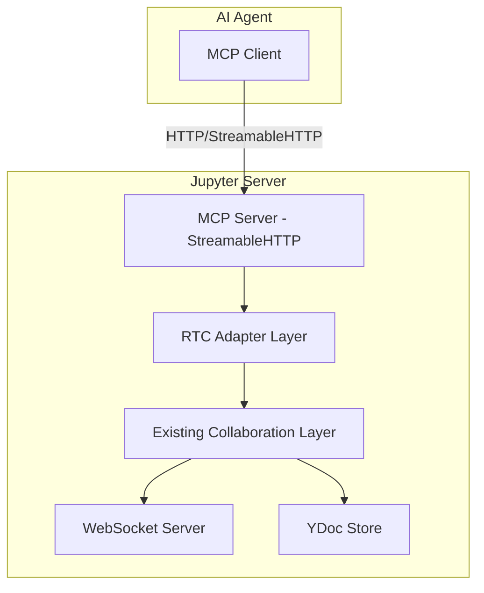

# MCP Server for Jupyter Collaboration - Design Document

## Overview

This document outlines the design for adding MCP (Model Context Protocol) server endpoints to expose Jupyter Collaboration's real-time collaboration (RTC) functionalities to AI agents. The solution will be implemented as a separate JupyterLab extension called `jupyter-collaboration-mcp`.

## Problem Statement

AI agents need a way to interact with collaborative Jupyter notebooks and documents in real-time. The existing Jupyter Collaboration system provides robust RTC capabilities using YDoc (CRDT) technology, but lacks an API specifically designed for AI agent integration. This project aims to bridge that gap by exposing RTC functionalities through MCP endpoints.

## Architecture

### High-Level Architecture



### Key Components

1. **MCP Server (StreamableHTTP)**: Based on the MCP StreamableHTTP example, using HTTP with Streamable HTTP for bidirectional communication with AI agents.

2. **RTC Adapter Layer**: A new component that translates MCP requests into operations on the existing collaboration system.

3. **Event Store**: For resumability and state management, similar to the example's `InMemoryEventStore`.

4. **Authentication & Authorization**: Integrated with Jupyter's existing security infrastructure.

## Implementation Approach

### Separate Extension vs. Feature PR

After analyzing the project structure and requirements, we recommend implementing this as a **separate JupyterLab extension** rather than a feature PR into the existing project.

### Advantages of a Separate Extension

1. **Modularity**: Keeps MCP-specific code isolated from the core collaboration functionality
2. **Maintainability**: Easier to update and maintain without affecting the stable collaboration features
3. **Optional Installation**: Users can choose whether to install MCP functionality
4. **Independent Development**: Can follow its own release cycle independent of the main collaboration project
5. **Clear Separation of Concerns**: The main project focuses on RTC, while the new extension focuses on AI agent integration

### FastMCP-Based Implementation

The implementation uses **FastMCP** - a high-level wrapper around the MCP protocol that provides a more declarative and Pythonic way to define tools and resources. This approach offers several advantages over the low-level MCP server API:

1. **Declarative Tool Definition**: Tools are defined using Python decorators, making the code more readable and maintainable
2. **Automatic Schema Generation**: FastMCP automatically generates JSON schemas for tool inputs based on function signatures
3. **Type Safety**: Leverages Python type hints for better type checking and validation
4. **Modular Organization**: Tools are organized into logical groups (notebook, document, awareness) for better code organization
5. **Simplified Registration**: Tool registration is handled automatically by the FastMCP framework

### Proposed Extension Structure

```
jupyter-collaboration-mcp/
├── pyproject.toml
├── setup.py
├── jupyter_collaboration_mcp/
│   ├── __init__.py
│   ├── app.py              # Main MCP server application
│   ├── tools/             # MCP tool definitions using FastMCP
│   │   ├── __init__.py
│   │   ├── notebook.py     # Notebook collaboration tools
│   │   ├── document.py     # Document collaboration tools
│   │   └── awareness.py    # User awareness and presence tools
│   ├── rtc_adapter.py      # Adapter to existing RTC functionality
│   ├── event_store.py     # For resumability
│   ├── auth.py            # Authentication and authorization
│   └── utils.py           # Utility functions
└── tests/
    ├── __init__.py
```

## MCP Endpoints

### Notebook Collaboration Features

#### 1. Notebook Access and Management

##### Tool: `list_notebooks`

- **Description**: List available notebooks for collaboration with optional filtering and size control
- **Input Schema**:
  ```json
  {
    "type": "object",
    "properties": {
      "path_prefix": {
        "type": "string",
        "description": "Optional path prefix to filter notebooks"
      },
      "max_results": {
        "type": "integer",
        "default": 50,
        "description": "Maximum number of results to return"
      }
    }
  }
  ```
- **Returns**: Description string and list of notebook info objects with paths and collaboration status

##### Tool: `get_notebook`

- **Description**: Get a notebook's content with cells and optional collaboration metadata, with size control
- **Input Schema**:
  ```json
  {
    "type": "object",
    "required": ["path"],
    "properties": {
      "path": {
        "type": "string",
        "description": "Path to the notebook"
      },
      "include_collaboration_state": {
        "type": "boolean",
        "default": true,
        "description": "Whether to include collaboration metadata"
      },
      "max_content_length": {
        "type": "integer",
        "default": 100000,
        "description": "Maximum content length in characters to prevent context overflow"
      }
    }
  }
  ```
- **Returns**: Description with content size information and the notebook data

##### Tool: `create_notebook_session`

- **Description**: Creates or retrieves a collaboration session for a notebook
- **Input Schema**:
  ```json
  {
    "type": "object",
    "required": ["path"],
    "properties": {
      "path": {
        "type": "string",
        "description": "Path to the notebook"
      }
    }
  }
  ```
- **Returns**: Session information including room ID and session ID

#### 2. Notebook Content Manipulation

##### Tool: `batch_update_notebook_cells`

- **Description**: Batch update multiple cells in a notebook with range-based operations
- **Input Schema**:
  ```json
  {
    "type": "object",
    "required": ["path", "updates"],
    "properties": {
      "path": {
        "type": "string",
        "description": "Path to the notebook"
      },
      "updates": {
        "type": "array",
        "items": {
          "type": "object",
          "properties": {
            "content": {
              "type": "string",
              "description": "New content for the cell"
            },
            "cell_type": {
              "type": "string",
              "enum": ["code", "markdown"],
              "description": "Type of the cell"
            }
          }
        },
        "description": "List of update operations"
      },
      "start_index": {
        "type": "integer",
        "description": "Starting index for range-based updates (optional)"
      },
      "end_index": {
        "type": "integer",
        "description": "Ending index for range-based updates (optional)"
      },
      "cell_ids": {
        "type": "array",
        "items": {
          "type": "string"
        },
        "description": "Specific cell IDs to update (optional)"
      },
      "exec": {
        "type": "boolean",
        "default": true,
        "description": "Whether to execute cells after update"
      }
    }
  }
  ```
- **Returns**: Description of operation results and list of update confirmations

##### Tool: `batch_insert_notebook_cells`

- **Description**: Batch insert multiple cells into a notebook at specified positions
- **Input Schema**:
  ```json
  {
    "type": "object",
    "required": ["path", "cells"],
    "properties": {
      "path": {
        "type": "string",
        "description": "Path to the notebook"
      },
      "cells": {
        "type": "array",
        "items": {
          "type": "object",
          "properties": {
            "content": {
              "type": "string",
              "description": "Content for the new cell"
            },
            "cell_type": {
              "type": "string",
              "enum": ["code", "markdown"],
              "default": "code",
              "description": "Type of the cell"
            }
          }
        },
        "description": "List of cell data"
      },
      "start_position": {
        "type": "integer",
        "description": "Starting position for range-based inserts (optional)"
      },
      "positions": {
        "type": "array",
        "items": {
          "type": "integer"
        },
        "description": "Specific positions for each cell (optional)"
      },
      "exec": {
        "type": "boolean",
        "default": true,
        "description": "Whether to execute cells after insertion"
      }
    }
  }
  ```
- **Returns**: Description of operation results and list of inserted cell information

##### Tool: `batch_delete_notebook_cells`

- **Description**: Batch delete multiple cells from a notebook by range or specific IDs
- **Input Schema**:
  ```json
  {
    "type": "object",
    "required": ["path"],
    "properties": {
      "path": {
        "type": "string",
        "description": "Path to the notebook"
      },
      "start_index": {
        "type": "integer",
        "description": "Starting index for range-based deletion (optional)"
      },
      "end_index": {
        "type": "integer",
        "description": "Ending index for range-based deletion (optional)"
      },
      "cell_ids": {
        "type": "array",
        "items": {
          "type": "string"
        },
        "description": "Specific cell IDs to delete (optional)"
      },
      "exec": {
        "type": "boolean",
        "default": true,
        "description": "Whether to execute cells before deletion"
      }
    }
  }
  ```
- **Returns**: Description of operation results and list of deletion confirmations

#### 3. Notebook Execution

##### Tool: `execute_notebook_cell`

- **Description**: Executes a specific cell in a notebook
- **Input Schema**:
  ```json
  {
    "type": "object",
    "required": ["path", "cell_id"],
    "properties": {
      "path": {
        "type": "string",
        "description": "Path to the notebook"
      },
      "cell_id": {
        "type": "string",
        "description": "ID of the cell to execute"
      },
      "timeout": {
        "type": "integer",
        "description": "Execution timeout in seconds",
        "default": 30
      }
    }
  }
  ```
- **Returns**: Execution result including output and execution count

### Document Collaboration Features

#### 1. Document Access and Management

##### Tool: `list_documents`

- **Description**: List available documents for collaboration with optional filtering and size control
- **Input Schema**:
  ```json
  {
    "type": "object",
    "properties": {
      "path_filter": {
        "type": "string",
        "description": "Optional path to filter documents"
      },
      "file_type": {
        "type": "string",
        "description": "Optional file type to filter (e.g., 'file', 'text', 'markdown')"
      },
      "max_results": {
        "type": "integer",
        "default": 50,
        "description": "Maximum number of results to return"
      }
    }
  }
  ```
- **Returns**: Description string and list of document info objects with paths and collaboration status

##### Tool: `get_document`

- **Description**: Get a document's content with optional collaboration metadata and size control
- **Input Schema**:
  ```json
  {
    "type": "object",
    "required": ["path"],
    "properties": {
      "path": {
        "type": "string",
        "description": "Path to the document"
      },
      "include_collaboration_state": {
        "type": "boolean",
        "default": true,
        "description": "Whether to include collaboration metadata"
      },
      "max_content_length": {
        "type": "integer",
        "default": 100000,
        "description": "Maximum content length in characters to prevent context overflow"
      }
    }
  }
  ```
- **Returns**: Description with content size information and the document data

##### Tool: `create_document_session`

- **Description**: Creates or retrieves a collaboration session for a document
- **Input Schema**:
  ```json
  {
    "type": "object",
    "required": ["path"],
    "properties": {
      "path": {
        "type": "string",
        "description": "Path to the document"
      },
      "file_type": {
        "type": "string",
        "description": "Type of the document (auto-detected if not provided)"
      }
    }
  }
  ```
- **Returns**: Session information including room ID and session ID

#### 2. Document Content Manipulation

##### Tool: `batch_update_document`

- **Description**: Batch update a document's content with multiple precise operations
- **Input Schema**:
  ```json
  {
    "type": "object",
    "required": ["path", "operations"],
    "properties": {
      "path": {
        "type": "string",
        "description": "Path to the document"
      },
      "operations": {
        "type": "array",
        "items": {
          "type": "object",
          "properties": {
            "content": {
              "type": "string",
              "description": "New content"
            },
            "position": {
              "type": "integer",
              "default": -1,
              "description": "Position to start update (-1 for append)"
            },
            "length": {
              "type": "integer",
              "default": 0,
              "description": "Length of content to replace (0 for insert)"
            }
          }
        },
        "description": "List of update operations"
      }
    }
  }
  ```
- **Returns**: Description of operation results and list of update confirmations

##### Tool: `batch_insert_text`

- **Description**: Batch insert multiple text segments at specific positions in a document
- **Input Schema**:
  ```json
  {
    "type": "object",
    "required": ["path", "operations"],
    "properties": {
      "path": {
        "type": "string",
        "description": "Path to the document"
      },
      "operations": {
        "type": "array",
        "items": {
          "type": "object",
          "properties": {
            "text": {
              "type": "string",
              "description": "Text to insert"
            },
            "position": {
              "type": "integer",
              "description": "Position to insert at (0-based index)"
            }
          }
        },
        "description": "List of insert operations"
      }
    }
  }
  ```
- **Returns**: Description of operation results and list of insertion confirmations

##### Tool: `batch_delete_text`

- **Description**: Batch delete multiple text segments from specific positions in a document
- **Input Schema**:
  ```json
  {
    "type": "object",
    "required": ["path", "operations"],
    "properties": {
      "path": {
        "type": "string",
        "description": "Path to the document"
      },
      "operations": {
        "type": "array",
        "items": {
          "type": "object",
          "properties": {
            "position": {
              "type": "integer",
              "description": "Position to start deletion (0-based index)"
            },
            "length": {
              "type": "integer",
              "description": "Length of text to delete"
            }
          }
        },
        "description": "List of delete operations"
      }
    }
  }
  ```
- **Returns**: Description of operation results and list of deletion confirmations

#### 3. Document Versioning and History

##### Tool: `get_document_history`

- **Description**: Retrieves the version history of a document
- **Input Schema**:
  ```json
  {
    "type": "object",
    "required": ["path"],
    "properties": {
      "path": {
        "type": "string",
        "description": "Path to the document"
      },
      "limit": {
        "type": "integer",
        "description": "Maximum number of versions to return",
        "default": 10
      }
    }
  }
  ```
- **Returns**: List of document versions with timestamps and change summaries

##### Tool: `restore_document_version`

- **Description**: Restores a document to a previous version
- **Input Schema**:
  ```json
  {
    "type": "object",
    "required": ["path", "version_id"],
    "properties": {
      "path": {
        "type": "string",
        "description": "Path to the document"
      },
      "version_id": {
        "type": "string",
        "description": "ID of the version to restore"
      }
    }
  }
  ```
- **Returns**: Confirmation of the restoration

#### 4. Document Forking

##### Tool: `fork_document`

- **Description**: Creates a fork of a document
- **Input Schema**:
  ```json
  {
    "type": "object",
    "required": ["path"],
    "properties": {
      "path": {
        "type": "string",
        "description": "Path to the document to fork"
      },
      "title": {
        "type": "string",
        "description": "Title for the forked document"
      },
      "description": {
        "type": "string",
        "description": "Description for the forked document"
      },
      "synchronize": {
        "type": "boolean",
        "description": "Whether to keep the fork synchronized with the original",
        "default": false
      }
    }
  }
  ```
- **Returns**: Fork information including fork ID

##### Tool: `merge_document_fork`

- **Description**: Merges a fork back into the original document
- **Input Schema**:
  ```json
  {
    "type": "object",
    "required": ["path", "fork_id"],
    "properties": {
      "path": {
        "type": "string",
        "description": "Path to the original document"
      },
      "fork_id": {
        "type": "string",
        "description": "ID of the fork to merge"
      }
    }
  }
  ```
- **Returns**: Confirmation of the merge

### Awareness and User Presence Features

#### 1. User Presence Management

##### Tool: `get_online_users`

- **Description**: Retrieves a list of users currently online in the collaboration space
- **Input Schema**:
  ```json
  {
    "type": "object",
    "properties": {
      "document_path": {
        "type": "string",
        "description": "Optional path to filter users for a specific document"
      }
    }
  }
  ```
- **Returns**: List of online users with their identity information

##### Tool: `get_user_presence`

- **Description**: Retrieves presence information for a specific user
- **Input Schema**:
  ```json
  {
    "type": "object",
    "required": ["user_id"],
    "properties": {
      "user_id": {
        "type": "string",
        "description": "ID of the user"
      },
      "document_path": {
        "type": "string",
        "description": "Optional path to check presence in a specific document"
      }
    }
  }
  ```
- **Returns**: User presence information including status, last activity, and current document

##### Tool: `set_user_presence`

- **Description**: Sets the presence status for the current user
- **Input Schema**:
  ```json
  {
    "type": "object",
    "properties": {
      "status": {
        "type": "string",
        "enum": ["online", "away", "busy", "offline"],
        "description": "Presence status",
        "default": "online"
      },
      "message": {
        "type": "string",
        "description": "Optional status message"
      }
    }
  }
  ```
- **Returns**: Confirmation of the presence update

#### 2. Cursor and Selection Tracking

##### Tool: `get_user_cursors`

- **Description**: Retrieves cursor positions of users in a document
- **Input Schema**:
  ```json
  {
    "type": "object",
    "required": ["document_path"],
    "properties": {
      "document_path": {
        "type": "string",
        "description": "Path to the document"
      }
    }
  }
  ```
- **Returns**: List of user cursor positions with line, column, and selection information

##### Tool: `update_cursor_position`

- **Description**: Updates the current user's cursor position in a document
- **Input Schema**:
  ```json
  {
    "type": "object",
    "required": ["document_path", "position"],
    "properties": {
      "document_path": {
        "type": "string",
        "description": "Path to the document"
      },
      "position": {
        "type": "object",
        "required": ["line", "column"],
        "properties": {
          "line": {
            "type": "integer",
            "description": "Line number (0-based)"
          },
          "column": {
            "type": "integer",
            "description": "Column number (0-based)"
          }
        }
      },
      "selection": {
        "type": "object",
        "properties": {
          "start": {
            "type": "object",
            "required": ["line", "column"],
            "properties": {
              "line": { "type": "integer" },
              "column": { "type": "integer" }
            }
          },
          "end": {
            "type": "object",
            "required": ["line", "column"],
            "properties": {
              "line": { "type": "integer" },
              "column": { "type": "integer" }
            }
          }
        }
      }
    }
  }
  ```
- **Returns**: Confirmation of the cursor update

#### 3. User Activity Tracking

##### Tool: `get_user_activity`

- **Description**: Retrieves recent activity for users in the collaboration space
- **Input Schema**:
  ```json
  {
    "type": "object",
    "properties": {
      "document_path": {
        "type": "string",
        "description": "Optional path to filter activity for a specific document"
      },
      "limit": {
        "type": "integer",
        "description": "Maximum number of activities to return",
        "default": 20
      }
    }
  }
  ```
- **Returns**: List of recent user activities with timestamps and descriptions

##### Tool: `broadcast_user_activity`

- **Description**: Broadcasts a user activity to other collaborators
- **Input Schema**:
  ```json
  {
    "type": "object",
    "required": ["activity_type", "description"],
    "properties": {
      "activity_type": {
        "type": "string",
        "description": "Type of activity (e.g., 'edit', 'view', 'execute')"
      },
      "description": {
        "type": "string",
        "description": "Human-readable description of the activity"
      },
      "document_path": {
        "type": "string",
        "description": "Path to the related document (if applicable)"
      },
      "metadata": {
        "type": "object",
        "description": "Additional metadata about the activity"
      }
    }
  }
  ```
- **Returns**: Confirmation of the activity broadcast

#### 4. Collaboration Sessions

##### Tool: `get_active_sessions`

- **Description**: Retrieves active collaboration sessions
- **Input Schema**:
  ```json
  {
    "type": "object",
    "properties": {
      "document_path": {
        "type": "string",
        "description": "Optional path to filter sessions for a specific document"
      }
    }
  }
  ```
- **Returns**: List of active sessions with participant information

##### Tool: `join_session`

- **Description**: Joins an existing collaboration session
- **Input Schema**:
  ```json
  {
    "type": "object",
    "required": ["session_id"],
    "properties": {
      "session_id": {
        "type": "string",
        "description": "ID of the session to join"
      }
    }
  }
  ```
- **Returns**: Confirmation of joining the session

##### Tool: `leave_session`

- **Description**: Leaves a collaboration session
- **Input Schema**:
  ```json
  {
    "type": "object",
    "required": ["session_id"],
    "properties": {
      "session_id": {
        "type": "string",
        "description": "ID of the session to leave"
      }
    }
  }
  ```
- **Returns**: Confirmation of leaving the session

## Authentication and Authorization

### Authentication Strategy

#### 1. Simple Token Authentication

- **Token-Based**: MCP requests require a simple token for authentication
- **Token Source**: Token is provided via `--IdentityProvider.token=xxx` command line option
- **Token Validation**: Server validates that the token matches the one provided at startup
- **Rate Limiting**: Implement rate limiting to prevent abuse

#### 2. Integration with Jupyter Auth

- **Leverage Existing Auth**: Use Jupyter's authentication mechanisms rather than creating a new system
- **Session Management**: Respect Jupyter's session lifecycle and timeout policies
- **User Identity**: Maintain consistent user identity across Jupyter and MCP endpoints

### Authorization Model

#### 1. Resource-Based Access Control

- **Document-Level Permissions**: Check permissions for each document access
- **Path-Based Authorization**: Ensure users can only access documents they have permissions for
- **Session-Level Authorization**: Validate that users can join or interact with collaboration sessions

#### 2. Permission Levels

- **Read Access**: View document content and collaboration state
- **Write Access**: Modify document content
- **Execute Access**: Execute notebook cells (for notebooks)
- **Admin Access**: Manage collaboration sessions and forks

### Security Considerations

#### 1. Token Security

- **Token Transmission**: Tokens are transmitted in the Authorization header
- **Token Validation**: Simple string comparison to validate tokens
- **Rate Limiting**: Implement appropriate rate limiting for requests
- **CORS Configuration**: Restrict access to approved origins
- **Secure Transmission**: Ensure all communication is over HTTPS

#### 2. CORS Configuration

- **Restricted Origins**: Only allow requests from approved origins
- **Credential Handling**: Proper handling of credentials in cross-origin requests

#### 3. Rate Limiting

- **Request Throttling**: Implement rate limiting to prevent abuse
- **Resource Limits**: Set limits on document sizes and operation frequencies

## Implementation Plan

### Phase 1: Project Setup and Core Infrastructure

#### 1.1 Create the Extension Project Structure

```
jupyter-collaboration-mcp/
├── pyproject.toml
├── setup.py
├── jupyter_collaboration_mcp/
│   ├── __init__.py
│   ├── app.py              # Main MCP server application
│   ├── tools/             # MCP tool definitions using FastMCP
│   │   ├── __init__.py
│   │   ├── notebook.py     # Notebook collaboration tools
│   │   ├── document.py     # Document collaboration tools
│   │   └── awareness.py    # User awareness and presence tools
│   ├── rtc_adapter.py      # Adapter to existing RTC functionality
│   ├── event_store.py     # For resumability
│   ├── auth.py            # Authentication and authorization
│   └── utils.py           # Utility functions
└── tests/
    ├── __init__.py
    ├── test_app.py
    ├── test_tools.py
    │   ├── __init__.py
    │   ├── test_notebook.py
    │   ├── test_document.py
    │   └── test_awareness.py
    └── test_auth.py
```

#### 1.2 Set Up Dependencies

The project depends on core Jupyter and MCP packages:

- jupyter-server: For Jupyter server functionality
- jupyter-collaboration: For real-time collaboration features (includes YDoc support)
- mcp: For the Model Context Protocol server implementation
- pydantic: For data validation and serialization

#### 1.3 Implement Core MCP Server with FastMCP

The MCP server is implemented using FastMCP, which provides a high-level, declarative approach to defining MCP tools. The server is initialized with a name and description, and tools are registered using Python decorators. The server handles HTTP requests with Streamable HTTP for bidirectional communication with AI agents.

Authentication is implemented as middleware that validates tokens from Jupyter's authentication system. The server integrates with Jupyter's extension system to be loaded as a server extension.

### Phase 2: RTC Adapter Implementation

#### 2.1 Create RTC Adapter Class

The RTC Adapter serves as a bridge between MCP requests and Jupyter Collaboration functionality. It initializes with the Jupyter server application and accesses the YDoc extension that provides real-time collaboration capabilities.

The adapter is responsible for:

- Initializing the connection to Jupyter's collaboration system
- Translating MCP tool requests into operations on YDoc documents
- Managing document sessions and collaboration state
- Providing access to user presence and awareness information

Key methods include document retrieval, document listing, session management, and user activity tracking. The adapter ensures that all MCP operations are properly synchronized with the underlying YDoc CRDT system.

### Phase 3: MCP Tools Implementation

#### 3.1 Implement Tools with FastMCP

The implementation uses FastMCP, which provides a high-level, declarative approach to defining MCP tools. Instead of manually handling tool registration and request routing, FastMCP uses Python decorators to automatically register tools and generate their schemas.

Tools are defined as async functions with the `@fastmcp.tool()` decorator, which includes:

- A descriptive name for the tool
- An AI-oriented description focused on usage rather than implementation
- Type-hinted parameters for automatic schema generation
- Failsafe default values for size-limiting parameters to prevent context overflow
- Comprehensive docstrings with examples

Each tool returns structured data that FastMCP automatically formats into the appropriate MCP response format.

#### 3.2 Tool Module Organization

The tools are organized into a modular structure with separate modules for each category:

1. **tools/notebook.py**: Contains all notebook collaboration tools

   - `list_notebooks`: Lists available notebooks with size control
   - `get_notebook`: Retrieves notebook content with size control
   - `create_notebook_session`: Creates or retrieves collaboration sessions
   - `batch_update_notebook_cells`: Batch update cells with range-based operations
   - `batch_insert_notebook_cells`: Batch insert cells at specified positions
   - `batch_delete_notebook_cells`: Batch delete cells by range or ID
   - `batch_execute_notebook_cells`: Batch execute cells with timeout control

2. **tools/document.py**: Contains all document collaboration tools

   - `list_documents`: Lists available documents with size control
   - `get_document`: Retrieves document content with size control
   - `create_document_session`: Creates or retrieves collaboration sessions
   - `batch_update_document`: Batch update with multiple precise operations
   - `batch_insert_text`: Batch insert text segments at specific positions
   - `batch_delete_text`: Batch delete text segments from specific positions
   - `get_document_history`: Retrieves version history with size control
   - `restore_document_version`: Restores document to a previous version
   - `fork_document`: Creates a fork for parallel editing
   - `merge_document_fork`: Merges a fork back into the original

3. **tools/awareness.py**: Contains all user awareness and presence tools
   - `get_online_users`: Retrieves list of online users
   - `get_user_presence`: Retrieves presence information for a specific user
   - `set_user_presence`: Sets the current user's presence status
   - `get_user_cursors`: Gets cursor positions of users in documents
   - `update_cursor_position`: Updates current user's cursor position
   - `get_user_activity`: Retrieves recent activity with size control
   - `broadcast_user_activity`: Broadcasts user activity to collaborators
   - `get_active_sessions`: Retrieves active collaboration sessions
   - `join_session`: Joins an existing collaboration session
   - `leave_session`: Leaves a collaboration session

#### 3.3 Tool Implementation Improvements

The tools have been enhanced with several improvements:

1. **AI-Oriented Descriptions**: Tool descriptions are written specifically for AI agents, focusing on how to use the tool rather than implementation details.

2. **Batch Operations**: Single cell/text operations have been replaced with batch operations to reduce API call roundtrips and improve efficiency:

   - Range-based operations for contiguous cells/text segments
   - ID-based operations for specific cells/text segments
   - Support for mixed operations in a single call

3. **Size Control Parameters**: All tools that return potentially large amounts of data include size-limiting parameters with sensible defaults:

   - `max_results`: Limits the number of items returned (default: 50)
   - `max_content_length`: Limits the size of content returned (default: 100000)
   - `limit`: Limits the number of history/activity entries (default: 10-20)

4. **Session Reminders**: Tools that modify content or retrieve collaboration state include reminders about creating or joining collaboration sessions for real-time editing.

5. **Failsafe Defaults**: All size-limiting parameters have reasonable default values to prevent context overflow even when not explicitly specified.

Each tool follows a consistent implementation pattern:

1. Validate input parameters
2. Apply size limits if specified
3. Call the appropriate RTC adapter method
4. Format the response for AI agent consumption
5. Include session reminders where appropriate
6. Handle errors appropriately with meaningful messages

The tools are designed to be discoverable and self-documenting, with clear descriptions and comprehensive examples that help AI agents understand how to use them effectively.

#### 3.4 Integration with MCP Server

The tools are automatically registered with the MCP server through the FastMCP framework. The server imports the tools module and uses the decorated functions to handle incoming MCP requests. The framework handles request routing, parameter validation, response formatting, and error handling, allowing developers to focus on the business logic of each tool.

### Phase 4: Authentication and Event Store

#### 4.1 Implement Authentication

Authentication is implemented using Jupyter's existing token-based authentication system. The MCP server validates incoming requests by checking for a valid token in the Authorization header. The token must match the one provided when starting Jupyter with the `--IdentityProvider.token` option.

Key aspects of the authentication implementation:

- Token extraction from HTTP headers
- Token validation against Jupyter's authentication system
- Rate limiting to prevent abuse
- Integration with Jupyter's user identity system
- Proper error handling for authentication failures

The authentication middleware ensures that only authorized users can access MCP endpoints and that user identity is properly propagated to the tool functions.

#### 4.2 Implement Event Store

The event store provides resumability and state management for the MCP server. It maintains a history of events that can be replayed when clients reconnect, ensuring they don't miss any updates during disconnections.

Key features of the event store implementation:

- In-memory storage of events with configurable retention limits
- Event indexing for efficient retrieval
- Stream-based organization to separate events by document or session
- Automatic cleanup of old events to manage memory usage
- Support for event replay after disconnections

The event store works with the Streamable HTTP mechanism to provide real-time updates to AI agents while maintaining the ability to resume sessions after interruptions.

### Phase 5: Testing and Documentation

#### 5.1 Write Tests

Comprehensive testing is essential to ensure the reliability and correctness of the MCP server implementation. The test suite covers:

- Unit tests for individual tool functions, mocking the RTC adapter to test input validation, error handling, and response formatting
- Integration tests for the MCP server, testing the complete request/response flow with realistic scenarios
- Authentication tests, verifying that token validation and rate limiting work correctly
- Event store tests, ensuring that events are properly stored, retrieved, and replayed
- Concurrency tests, validating that multiple simultaneous requests are handled correctly

Tests use pytest with async support for testing the asynchronous tool functions. Mock objects are used extensively to isolate the code under test from external dependencies.

#### 5.2 Create Documentation

Comprehensive documentation is created to support both users and developers:

- **API Documentation**: Detailed descriptions of all MCP tools, including their parameters, return values, and usage examples
- **Integration Guide**: Step-by-step instructions for integrating AI agents with the MCP server, including authentication setup and connection configuration
- **Examples**: Practical examples showing how to use the MCP tools for common scenarios like collaborative editing, document analysis, and session management
- **Deployment Guide**: Instructions for deploying the MCP server in different environments, including configuration options and security considerations
- **Developer Guide**: Information for contributors on how to extend the MCP server with new tools and features

### Phase 6: Deployment and Integration

#### 6.1 Package and Distribute

The MCP server is packaged as a standard Python package using pyproject.toml for configuration. The package includes:

- The core MCP server implementation
- Tool definitions for notebook, document, and awareness operations
- RTC adapter for integration with Jupyter Collaboration
- Authentication and event store components
- Test suite and documentation

The package is distributed via PyPI and can be installed using pip. It includes entry points for Jupyter server extension integration.

#### 6.2 Jupyter Server Extension Integration

The MCP server integrates with Jupyter as a server extension, automatically loading when Jupyter starts. The integration process involves:

- Registering the MCP server with Jupyter's extension system
- Setting up HTTP routes for MCP endpoints
- Initializing the RTC adapter with Jupyter's collaboration system
- Configuring authentication to use Jupyter's token system

Once integrated, the MCP server runs alongside Jupyter, providing MCP endpoints that AI agents can connect to for real-time collaboration features. The server leverages Jupyter's existing infrastructure for authentication, authorization, and document management.

The extension can be enabled or disabled through Jupyter's configuration system, allowing administrators to control access to MCP functionality.

## Benefits

1. **Modularity**: Keeps MCP functionality separate from core collaboration features
2. **Optional Installation**: Users can choose whether to install MCP capabilities
3. **AI Agent Integration**: Enables AI agents to participate in collaborative sessions
4. **Real-time Capabilities**: Leverages existing YDoc-based synchronization
5. **Security**: Maintains Jupyter's authentication and authorization standards

## Example Use Cases

1. **AI Assistant Integration**: AI agents can view and edit notebooks in real-time alongside human users
2. **Automated Documentation**: AI can generate documentation while observing document changes
3. **Collaborative Analysis**: Multiple AI agents can collaborate on data analysis tasks
4. **Code Review Automation**: AI can provide real-time feedback on code changes

## Next Steps

1. **Create Project Structure**: Set up the initial project structure and dependencies
2. **Implement Core MCP Server**: Build the basic MCP server with authentication
3. **Implement RTC Adapter**: Create the bridge between MCP and Jupyter Collaboration
4. **Implement Endpoints**: Add support for all defined MCP tools
5. **Testing**: Write comprehensive tests for all functionality
6. **Documentation**: Create user and developer documentation
7. **Deployment**: Package and distribute the extension
